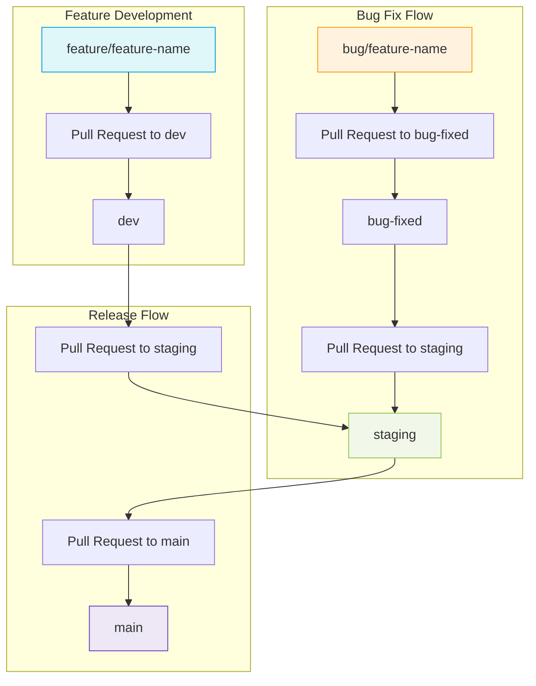

# 🗂️ Software Delivery Plan with Trello

This document outlines the task and bug management workflow using **Trello + GitHub**, ensuring clarity and traceability across the entire software lifecycle — from feature planning to production deployment.

## 📌 Overview

We use a **feature- and bug-based Trello board** to manage software development with integrated GitHub workflows.
Each card flows through a structured lifecycle, connected to branches and pull requests.

## 📋 Trello Board Structure (New)

| Trello List Name                  | Description                                                   |
| --------------------------------- | ------------------------------------------------------------- |
| **System Definitions / Features** | High-level modules/features proposed.                         |
| **To Do**                         | Features prepared by the Team Leader and ready for dev.       |
| **In Progress**                   | Features under active development.                            |
| **Code Review**                   | Features pending or undergoing review.                        |
| **Release Candidate**             | Features merged into `dev`, grouped for version planning.     |
| **Ready for QA**                  | A version build prepared and pushed to staging.               |
| **QA in Progress**                | A full version currently being tested.                        |
| **QA Issues Found**               | Bugs discovered during QA.                                    |
| **Bugs To Do**                    | Confirmed bugs, labeled and assigned.                         |
| **Bugs in Progress**              | Bugs under active development in grouped branches.            |
| **Bugs in Review**                | Bug fixes submitted via PR to `bug-fixed`, pending approval.  |
| **Bugs Fixed**                    | PR merged to `bug-fixed`, ready to push to staging.           |
| **Retesting Bugs**                | Bugs deployed to staging from `bug-fixed`, pending QA retest. |
| **Complete / Passed QA Test**     | Bugs confirmed resolved by QA.                                |
| **Ready for Deployment**          | The version is QA-approved and ready for production.          |
| **Deployed**                      | The version has been released to production.                  |

## 🔄 Feature & Bug Lifecycle

### **Feature Flow Example**
---

1. **To Do** → Team Leader creates a feature card, adds a `branch` label, assigns a dev.
2. **In Progress** → Developer creates branch `feature/feature-name`, starts coding.
3. **Code Review** → After implementation, PR is opened for review.
4. **Release Candidate** → Feature grouped for mobile/backend release.
5. **Ready for QA** → PR from `dev → staging`, version is created.
6. **QA in Progress** → QA validates the full version.
7. **Ready for Deployment** → All bugs fixed, QA approves version.
8. **Deployed** → PR from `staging → main` triggers deployment.

### **Bug Flow Example**
---

1. **QA Issues Found** → Tester logs a bug, links version, uses format: `bug(feature-name): title`.
2. **Bugs To Do** → Team Leader labels it `bug/feature-name`, assigns a dev.
3. **Bugs in Progress** → Dev creates branch `bug/feature-name`, first commit triggers move.
4. **Bugs in Review** → PR from bug branch → `bug-fixed`, reviewed by Team Leader.
5. **Bugs Fixed** → PR merged to `bug-fixed`.
6. **Retesting Bugs** → PR from `bug-fixed → staging`, QA retests.
7. **Complete / Passed QA Test** → QA confirms fix.
8. **If failed**, card returns to **QA Issues Found** with mention to Team Leader.

## 🧩 **Git Branch Workflow Diagram**

### 📌 Explanation of Branches

* **feature/feature-name**: A dedicated branch for each new feature.
* **bug/feature-name**: A shared bug fix branch that contains multiple fixes related to a specific feature.
* **dev**: The main development branch where all feature branches are merged.
* **bug-fixed**: A staging branch for approved bug fixes before they are pushed to staging.
* **staging**: The pre-production branch used for QA validation and testing.
* **main**: The production branch used for live deployment.

## ✅ Trello Card Rules

* **Feature Card Title**: `feature: cart filtering`
* **Bug Card Title**: `bug(cart): cart clears on refresh`
* **Label**:

  * `branch`: Used to map Git branch
  * `bug/feature-name`: Required for bug grouping
* **Checklist**:

  * Tasks (for features)
  * Reproduction steps (for bugs)
* **Assignment**: Always assigned to developer + QA
* **Movement**: GitHub Actions automate many transitions
---

# Built with ❤️ by the Mobile teams.

