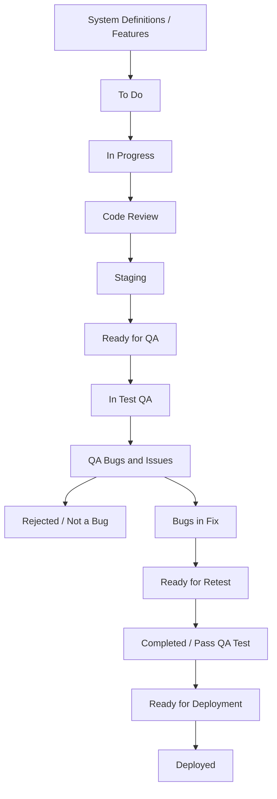

 
# 🗂️ Software Delivery Plan with Trello

This document outlines the task management workflow for delivering software using **Trello**. It maps each phase from initial planning through deployment, ensuring transparency and traceability across the entire team.

---

## 📌 Overview

We utilize a Kanban-style Trello board to manage tasks across multiple stages. Each task moves through structured phases, ensuring quality and coordination between development and QA.

---

## 📋 Trello Board Structure

| Trello List Name             | Description |
|-----------------------------|-------------|
| **System Definitions / Features** | High-level features/modules to build (e.g., Authentication, Orders). |
| **To Do**                   | Tasks approved and ready for development. |
| **In Progress**             | Tasks currently under development. |
| **Code Review**             | Tasks pending or undergoing code review. |
| **Staging (More Features)** | Deployed to staging for integrated testing. |
| **Ready for QA**            | Development complete, waiting for QA testing. |
| **In Test QA**              | QA team actively testing the feature. |
| **QA Bugs and Issues**      | Issues found during QA testing. |
| **Rejected / Not a Bug**    | QA-reported issues that are invalid. |
| **Bugs in Fix**             | Confirmed bugs under rework by devs. |
| **Ready for Retest**        | Fixed tasks waiting for retesting. |
| **Completed / Pass QA Test**| Tasks that have passed all QA checks. |
| **Ready for Deployment**    | Ready to deploy to production. |
| **Deployed**                | Live in production.

---

## 🔄 Task Lifecycle

Example: "Login with email"

1. **System Definitions / Features** → Authentication module added
2. **To Do** → Task created: “Login with email”
3. **In Progress** → Developers begin work
4. **Code Review** → Peer review initiated
5. **Staging (More Features)** → Pushed to staging
6. **Ready for QA** → Dev complete
7. **In Test QA** → QA testing begins
8. **QA Bugs and Issues** → Issues reported
9. **Bugs in Fix** → Devs fix confirmed bugs
10. **Ready for Retest** → Sent back to QA
11. **Completed / Pass QA Test** → QA passed
12. **Ready for Deployment** → Staging approved
13. **Deployed** → Feature goes live

---

## 📝 Trello Card Structure

Each task (Trello card) should contain:

- **Title**: Clear and descriptive (e.g., “Add login via email/password”)
- **Labels**: `Feature`, `Bug`, `Urgent`, etc.
- **Checklist**:
  - Requirements reviewed
  - Code implemented
  - Code reviewed
  - Deployed to staging
  - QA passed
  - Ready for production
- **Due Date**
- **Attachments**: Figma designs, PRs, docs
- **Members**: Developer, QA, Reviewer

---

## 🧠 Automation Tips (Optional)

Enhance Trello with automation:

- **Butler Rules**:
  - Move card to “In Progress” when a member is added
  - Move card to “Code Review” when checklist is complete
  - Move card to “Ready for QA” after review is approved
- **Power-Ups**:
  - Calendar view
  - Card Aging
  - GitHub/GitLab integration

---

## 🗺️ Workflow Diagram (Swimlane)
  
 

## ✅ Deployment Flow

* **Staging** is used for integration and QA validation.
* Deployment occurs only after QA passes all features grouped in a version.
* Production-ready versions are tagged (e.g., `v1.0.0 +2`).

---

## 👥 Roles

| Role          | Responsibility                            |
| ------------- | ----------------------------------------- |
| **Developer** | Implements tasks and fixes issues         |
| **QA**        | Validates tasks and logs bugs             |
| **Reviewer**  | Reviews code and provides feedback        |
| **PM/Lead**   | Prioritizes, assigns, and tracks progress |

---

## 📦 Versioning

All deployable releases should be grouped under a version tag:

* **v1.0.0 +2** = Version 1.0.0 with 2 additional patch/fix tasks.
* Document version labels in the **Ready for Deployment** and **Deployed** columns.

---

# Built with ❤️ by the moblie team .
 
 
